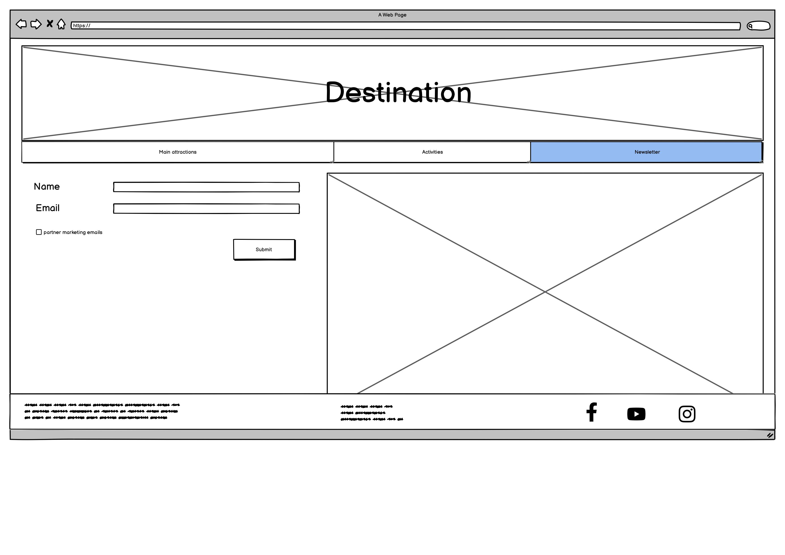

#  Visit Bristol  
Welcome to our first hackathon project!
> A travel guide for the Bristol area

**Team Members:** James (Team Lead), Elmi, Chris, Harrison   **Team Name:** TEAM JECH

Visit Bristol is a collaborative project, designed by 4 students at CodeInstitute.

# **Lo-Fi wireframes**

# colour palette 
Colours sourced from Coolers.com    # ECE0E6     # 0F7173     # 0093B0     # AEF5C7     # 8595A1

# font 
Two fonts sourced from google fonts - Quicksand - Sedgwick 

# languages used
HTML 5 - Hypertext markup language - revision 5
CSS 3 - Cascading style sheet - revision 3

# frameworks used
bootstrap   fontawesome favicons    

