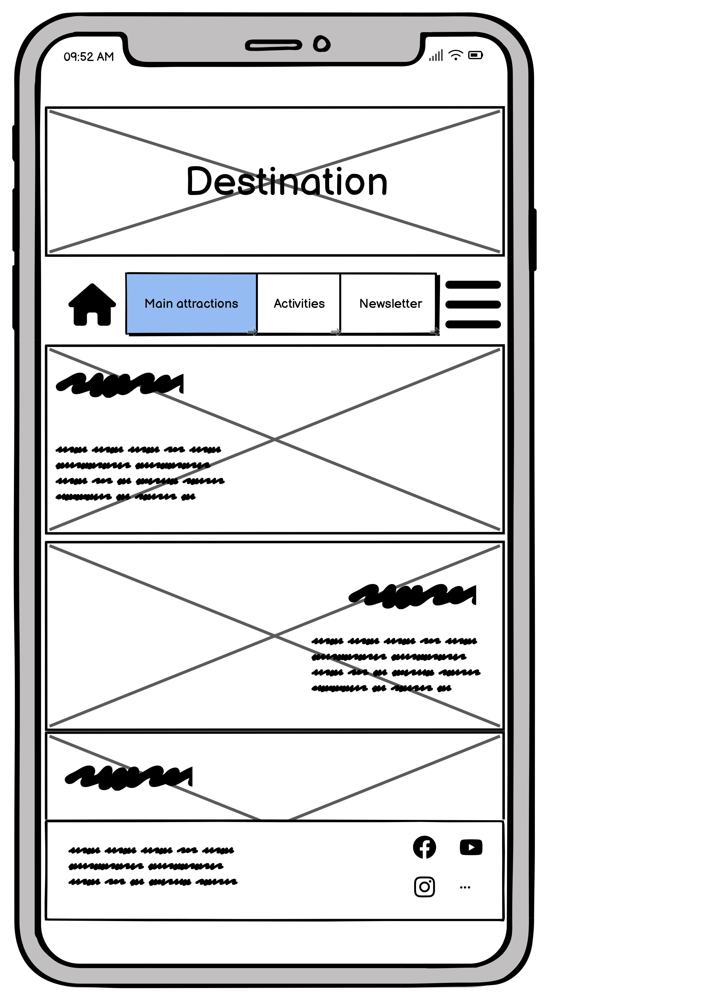
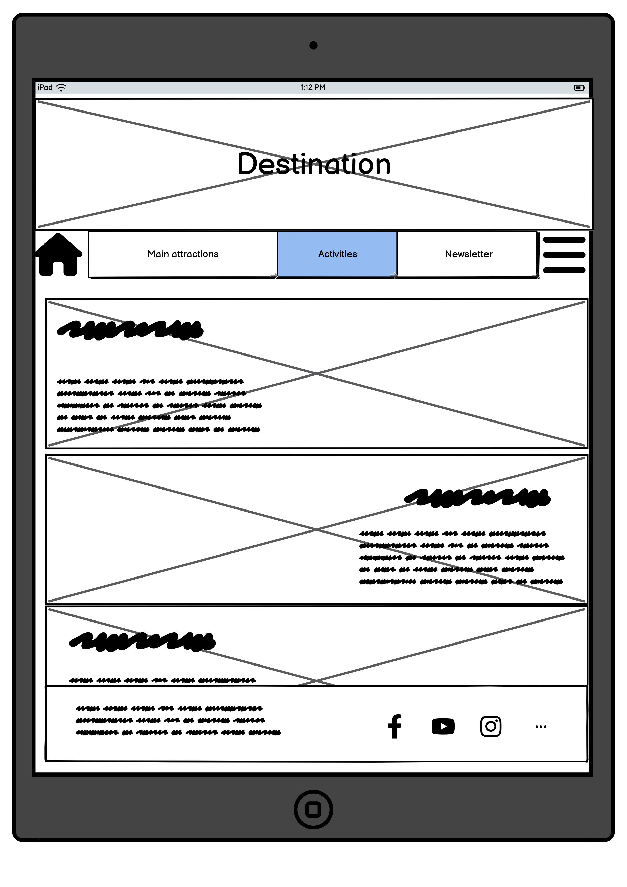
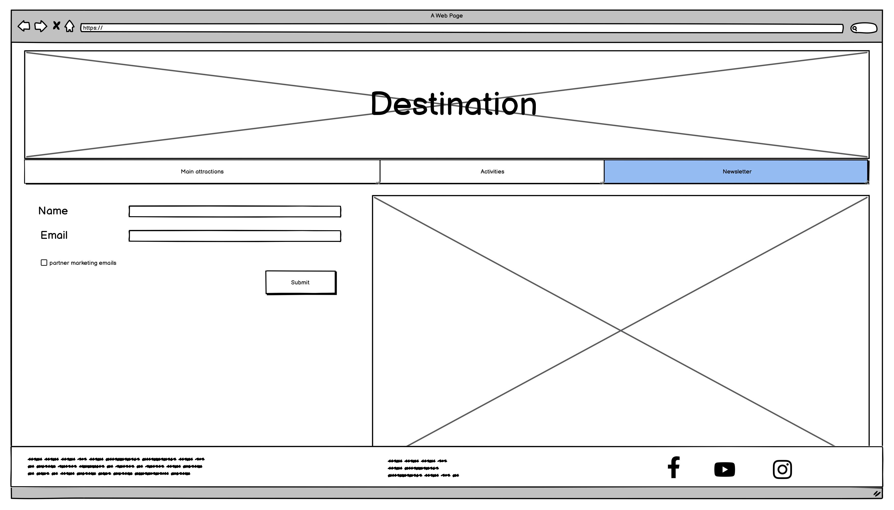
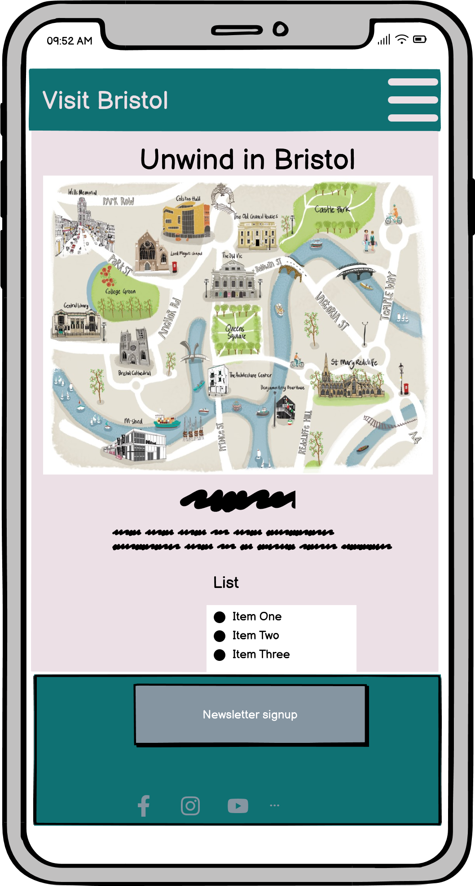
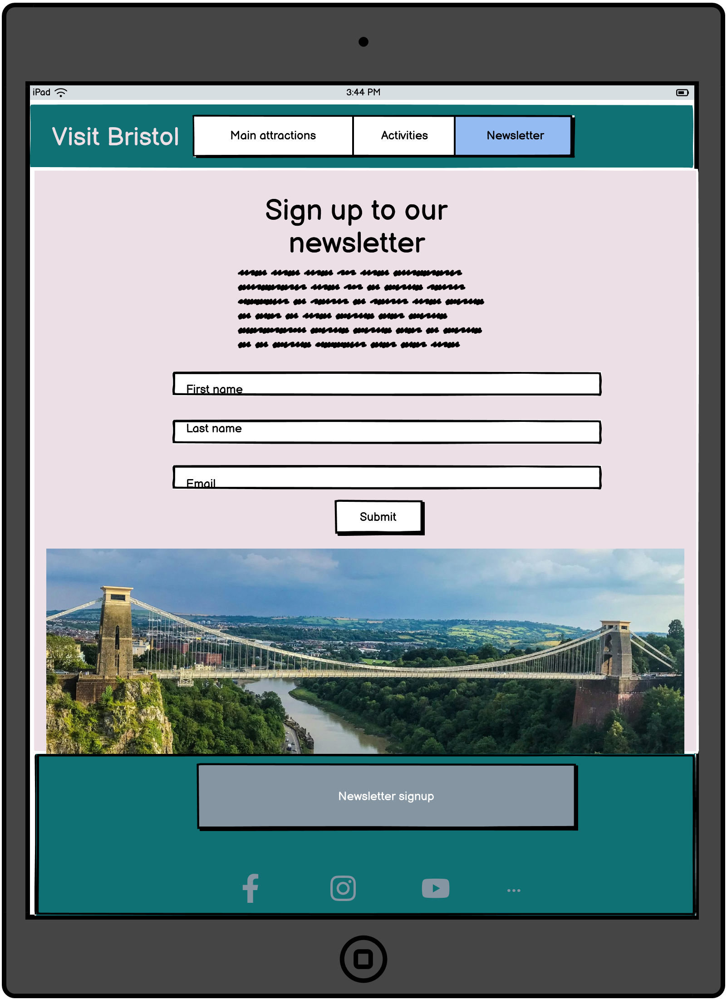
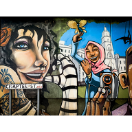

#  Visit Bristol  
Welcome to our first hackathon project!
> A travel guide for the Bristol area

**Team Members:** James (Team Lead), Elmi, Chris, Harrison   **Team Name:** TEAM JECH

Visit Bristol is a collaborative project, designed by 4 students at CodeInstitute.

# Wireframes

# Favicon

# Colour Palette 
Colours sourced from Coolers.com________ # ECE0E6________ # 0F7173________ # 0093B0________ # AEF5C7________ # 8595A1

# Fonts
Two fonts sourced from google fonts:  'Quicksand' & 'Sedgwick' 

# Features
- Wonderfully simplistic design
- Easy to use website
- Improve wellbeing by doing an activity

# Functionality
- Informative website with images and related text
- An option for users to sign up for a newsletter

# Technologies Used
- Languages  
**HTML:** The basic website structure  
**CSS:** The websites styling  
**Javascript:** The bootstrap CDN - For library components only!  
- Version Control  
**Github:** Everyone involved in the project were added to the repository as collaborators and each made their own branch to work off.
when a feature or change was created we then created pull requests. These are to be verified and merged with the main branch.

# Issues 
- An issue with the navbar, On mobile screens we cannot toggle the navbar button.
- An issue with the newsletter page, we cannot see the full image displayed as footer is in the way.

# Testing and Bugs
lorem ipsum

# Deployment
lorem ipsum
